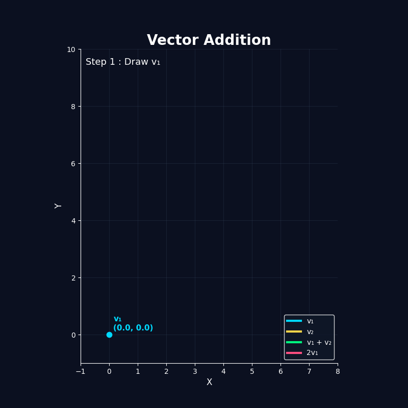
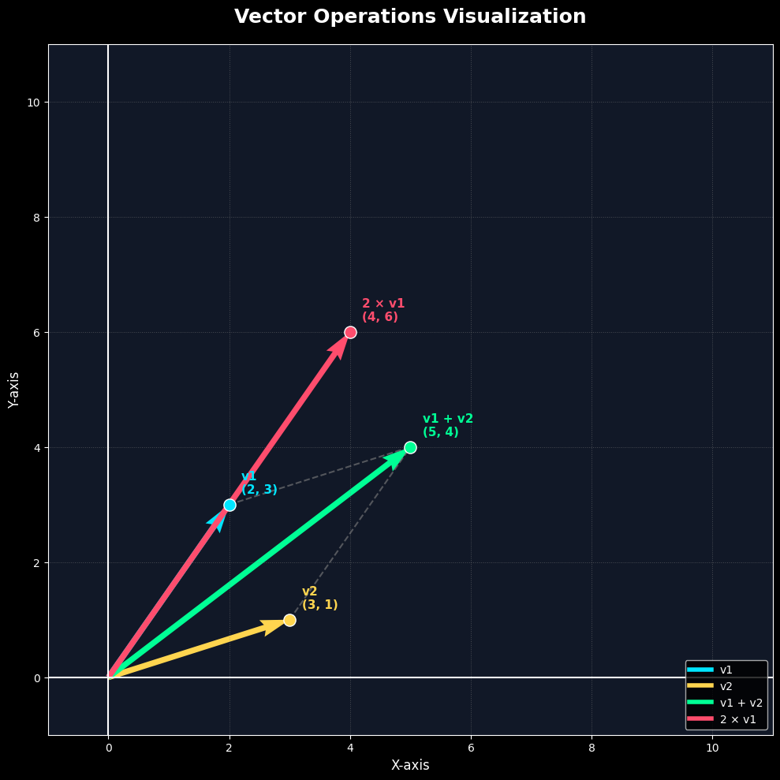

<div align="center">

# 🎨 Linear Algebra Visualization with Python

### 📐 Visualizing Linear Algebra Concepts Using Python, NumPy & Matplotlib

<p align="center">

</p>


---

*A visual approach to understanding Linear Algebra through high-quality static and animated visualizations.*

</div>

---

# 📖 Overview

This project demonstrates the most fundamental vector operations in **Linear Algebra** through beautiful and intuitive visualizations.

Instead of only reading formulas, learners can **see** how vectors behave on the coordinate plane.

This project currently includes:

- ➕ Vector Addition
- ✖️ Scalar Multiplication

Both concepts are implemented in:

- 📷 Static Visualization
- 🎬 Animated Visualization

---

# 🎥 Preview

## Animated Visualization

<p align="center">


</p>

---

## Static Visualization

<p align="center">



</p>

---

# ✨ Features

## 📊 Static Visualization

- Clean vector drawing
- Coordinate system
- Grid visualization
- Tail-to-head representation
- Parallelogram rule
- Vector labels
- Magnitude comparison
- Professional dark theme

---

## 🎬 Animated Visualization

- Smooth vector drawing
- Step-by-step explanation
- Tail-to-head animation
- Vector addition animation
- Scalar multiplication animation
- Fade transitions
- Educational annotations
- Automatic GIF generation

---

# 🧠 Mathematical Concepts

This project demonstrates:

- Cartesian Coordinates
- Vectors
- Vector Components
- Vector Addition
- Tail-to-Head Rule
- Parallelogram Rule
- Scalar Multiplication
- Coordinate Geometry

---

# 🛠 Technologies

| Technology | Purpose |
|------------|---------|
| Python | Programming Language |
| NumPy | Vector Mathematics |
| Matplotlib | Visualization |
| Pillow | GIF Export |

---

# 📂 Project Structure

```text
01-Vector-Visualization/
│
├── README.md
├── requirements.txt
│
├── static_vector_visualization.py
├── animated_vector_visualization.py
│
├── notebooks/
│   ├── static_vector_visualization.ipynb
│   └── animated_vector_visualization.ipynb
│
├── images/
│   └── static_vector_visualization.png
│
└── animations/
    └── vector_operations.gif
```

---

# ⚙ Installation

Clone the repository

```bash
git clone https://github.com/islam3ouf/Linear-Algebra-Visualization-With-Python.git
```

Move to the project

```bash
cd Linear-Algebra-Visualization-With-Python/01-Vector-Visualization
```

Install dependencies

```bash
pip install -r requirements.txt
```

---

# 📦 Requirements

```
numpy
matplotlib
Pillow
```

or

```bash
pip install -r requirements.txt
```

---

# ▶ Running the Project

## Static Visualization

```bash
python static_vector_visualization.py
```

---

## Animated Visualization

```bash
python animated_vector_visualization.py
```

After execution, the animation will automatically generate:

```
vector_operations.gif
```

---

# 📚 Learning Objectives

By completing this project, you will understand:

✔ Vector representation

✔ Coordinate systems

✔ Vector addition

✔ Scalar multiplication

✔ Tail-to-head method

✔ Parallelogram rule

✔ Mathematical visualization

---

# 🚀 Roadmap

This project is part of a complete **Linear Algebra Visualization** series.

Upcoming projects include:

- ✅ Vector Visualization
- ⬜ Vector Norm
- ⬜ Unit Vector
- ⬜ Dot Product
- ⬜ Cross Product
- ⬜ Angle Between Vectors
- ⬜ Projection
- ⬜ Linear Combination
- ⬜ Span
- ⬜ Linear Independence
- ⬜ Basis
- ⬜ Matrix Multiplication
- ⬜ Matrix Transformation
- ⬜ Determinant
- ⬜ Eigenvalues
- ⬜ Eigenvectors
- ⬜ Singular Value Decomposition (SVD)
- ⬜ Principal Component Analysis (PCA)

---

# 🤝 Contributing

Contributions are welcome!

If you have ideas for improving visualizations or adding new Linear Algebra concepts, feel free to open an Issue or submit a Pull Request.

---

# 📜 License

This project is licensed under the MIT License.

---

# ⭐ Support

If you enjoyed this project and found it useful,

please consider giving the repository a ⭐ on GitHub.

It really helps the project grow and reach more learners.

---

<div align="center">

## 👨‍💻 Author

**Islam Ouff**

Building beautiful mathematical visualizations with Python.

Made with ❤️ and lots of ☕

</div>
