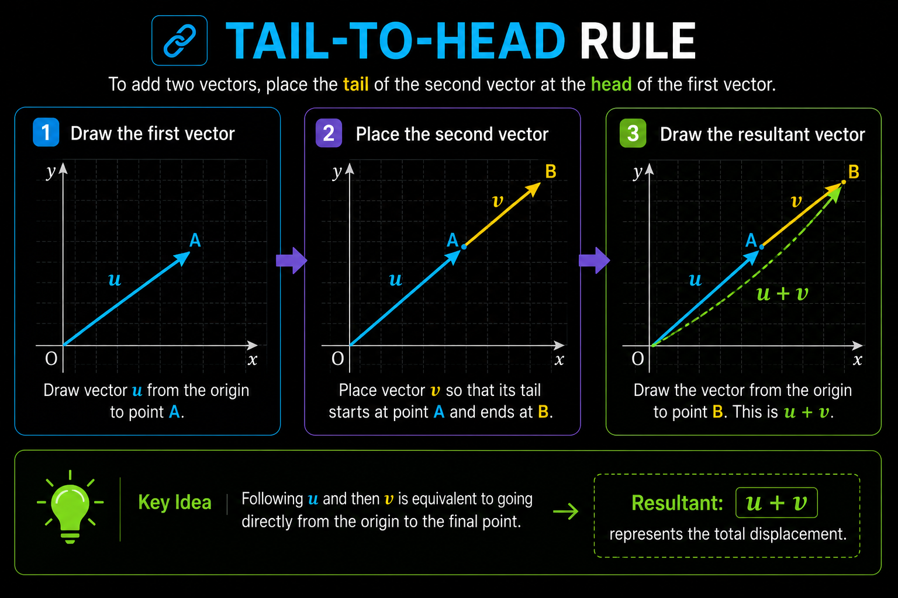
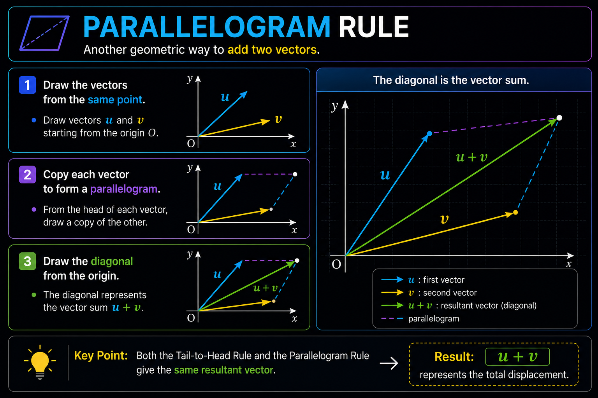
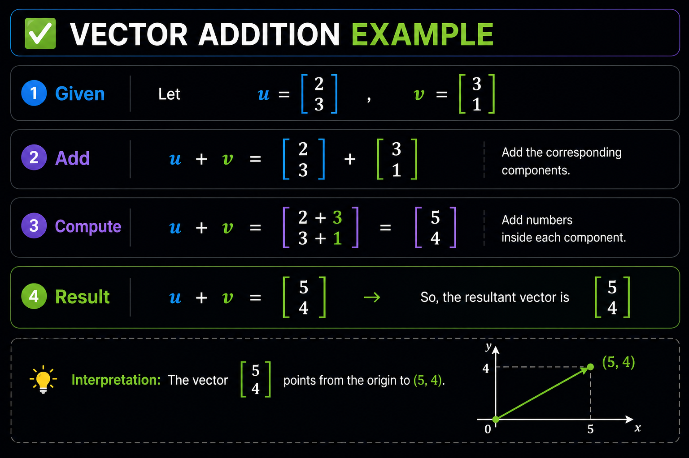

# ➕ Vector Addition

Vector addition is one of the most fundamental operations in Linear Algebra.

It allows us to combine two or more vectors into a single vector that represents their overall effect.

Think of a vector as a movement:

- Move according to the first vector.
- Then move according to the second vector.
- The final position is represented by the **resultant vector**.

---

# 📖 Geometric Interpretation

A vector represents both **magnitude** (length) and **direction**.

Adding vectors does **not** mean adding their lengths.

Instead, we combine their directions and displacements to obtain a new vector.

Visually, vector addition answers the question:

> **"Where do I end up after performing both movements?"**

---

# 📍 Tail-to-Head Rule

The **Tail-to-Head Rule** is the most intuitive way to add vectors.

It works by placing the **tail** of the second vector at the **head** of the first vector.

    

The green vector represents the resultant vector

**u + v**

which describes the total displacement after both movements.

---

# ▱ Parallelogram Rule

Another geometric interpretation is the **Parallelogram Rule**.

1. Draw both vectors from the same starting point.
2. Copy each vector to complete a parallelogram.
3. Draw the diagonal from the common origin.

    

The diagonal always represents the vector sum

**u + v**

This construction produces exactly the same result as the Tail-to-Head Rule.

---

# 🧮 Formula

Vector addition is performed **component by component**.

Each coordinate is added independently.

- Add the **x-components** together.
- Add the **y-components** together.

    

---

# ✅ Example

Consider the vectors

- **u = (2, 3)**
- **v = (3, 1)**

Applying the vector addition formula gives

    

The resultant vector is

**(5, 4)**

which points from the origin directly to the final position.

---

# ❓ Why Is the Result the Diagonal?

This is one of the most beautiful geometric properties of vectors.

When two vectors start from the same point, they form two adjacent sides of a parallelogram.

Following **u** and then **v** reaches exactly the same destination as moving directly along the diagonal.

Therefore,

- First movement → **u**
- Second movement → **v**
- Combined movement → **u + v**

The diagonal represents the **total displacement** of both vectors and is therefore the unique resultant vector.

---

# 💡 Key Takeaways

- Vector addition combines **displacements**, not lengths.
- Components are added independently.
- The **Tail-to-Head Rule** is an intuitive geometric construction.
- The **Parallelogram Rule** produces the same resultant vector.
- The resultant vector always represents the overall displacement.
- For the example

  **(2, 3) + (3, 1) = (5, 4)**

  the resulting vector points directly to the final position after both movements.
