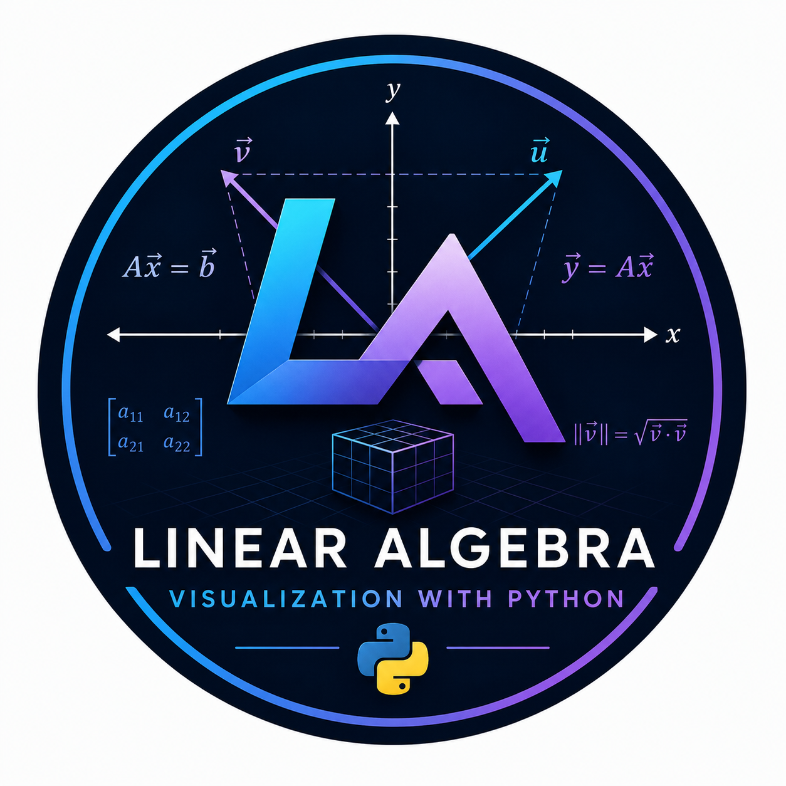
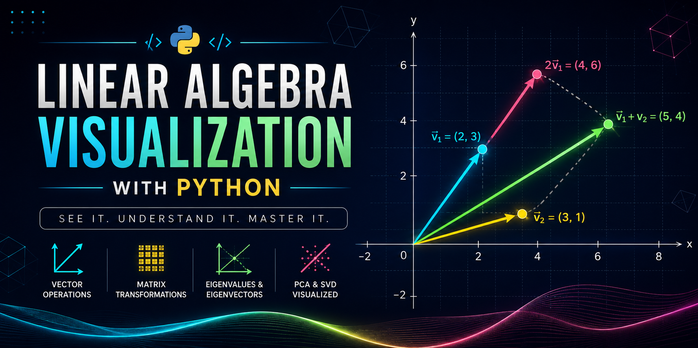

# Linear Algebra Visualization with Python


<p align="left">
  
</p>


<p align="center">
  
</p>
> Interactive visualizations and animations of Linear Algebra concepts using Python, NumPy, and Matplotlib, inspired by the legendary **3Blue1Brown – Essence of Linear Algebra** series.

## 📖 About

This repository documents my journey through the **Essence of Linear Algebra** series by **3Blue1Brown**.

The goal is not only to understand the mathematics behind Linear Algebra, but also to recreate its concepts using Python through interactive visualizations, animations, and simulations.

Every topic is implemented from scratch to build both mathematical intuition and practical programming skills.

---

## 🎯 Objectives

- Develop a deep intuition for Linear Algebra.
- Visualize abstract mathematical concepts.
- Build educational Python projects.
- Improve Python, NumPy, and Matplotlib skills.
- Create an open-source educational resource.

---

## 🛠️ Technologies

- Python
- NumPy
- Matplotlib
- Jupyter Notebook (optional)

---

## 📚 Topics

- [ ] Vectors
- [ ] Vector Addition
- [ ] Scalar Multiplication
- [ ] Linear Combinations
- [ ] Span
- [ ] Basis
- [ ] Linear Independence
- [ ] Dot Product
- [ ] Cross Product
- [ ] Matrices
- [ ] Matrix Multiplication
- [ ] Linear Transformations
- [ ] Determinants
- [ ] Inverse Matrices
- [ ] Systems of Linear Equations
- [ ] Change of Basis
- [ ] Eigenvectors & Eigenvalues
- [ ] Final Projects

---

## 📂 Repository Structure

```
Linear-Algebra-Visualization-With-Python/
│
├── source_code/
├── assets/
│   ├── images/
│   ├── gifs/
│   └── videos/
├── notebooks/
├── examples/
├── docs/
├── README.md
├── LICENSE
├── requirements.txt
└── .gitignore
```

---

## 🚀 Getting Started

Clone the repository

```bash
git clone https://github.com/YourUsername/Linear-Algebra-Visualization-With-Python.git
```

Install dependencies

```bash
pip install -r requirements.txt
```

Run any project

```bash
python source_code/project_name.py
```

---

## 🌟 Progress

This repository is continuously updated as I progress through the complete **Essence of Linear Algebra** course.

New projects, animations, and visual explanations will be added regularly.

---

## 🎥 Inspiration

This project is inspired by:

**3Blue1Brown — Essence of Linear Algebra**

One of the greatest visual mathematics series ever created.

---

## 🤝 Contributions

Suggestions, improvements, and pull requests are always welcome.

If you have an idea for a better visualization, feel free to contribute.

---

## ⭐ Support

If you find this repository useful, consider giving it a ⭐ on GitHub.

It helps the project reach more learners.

---

## 📜 License

This project is licensed under the MIT License.
